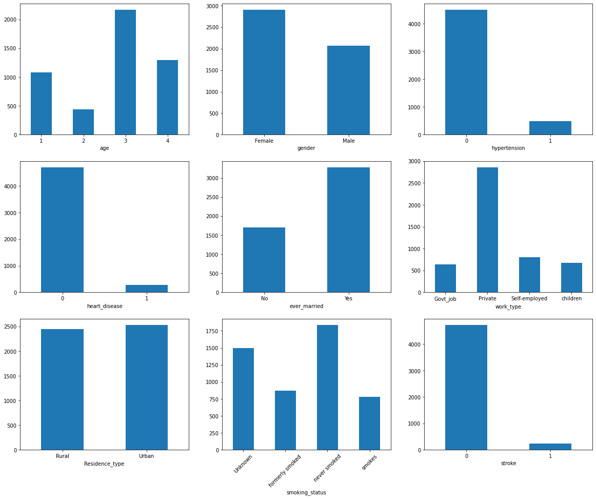

# Laporan Proyek Machine Learning - Christopher Adrian Kusuma

## Domain Proyek

Stroke merupakan penyebab kematian terbanyak kedua. Hal ini mengakibatkan banyaknya usaha untuk mendeteksi stroke sejak dini, salah satunya dengan metode data mining dan machine learning [1].

Referensi:
1. [Identifying Stroke Indicators Using Rough Set](https://ieeexplore.ieee.org/stamp/stamp.jsp?arnumber=9264165)

## Business Understanding

### Problem Statements
Adapun masalah yang diangkat adalah sebagai berikut:
- Bagaimana cara mendeteksi stroke menggunakan teknik machine learning?

### Goals
Adapun tujuan dari proyek ini adalah:
- Menggunakan machine learning untuk mendeteksi stroke

### Solution statements
Adapun solusi yang penulis tawarkan adalah sebagai berikut:
- Membandingkan hasil dari lima algoritma machine learning, yaitu AdaBoost, Gradient Boosting, Random Forest, Decision Tree, dan SVM
- Menggunakan berbagai metrik pengukuran, yaitu akurasi, precision, recall, dan f1-score.

## Data Understanding
Paragraf awal bagian ini menjelaskan informasi mengenai data yang Anda gunakan dalam proyek. Sertakan juga sumber atau tautan untuk mengunduh dataset. Contoh: [UCI Machine Learning Repository](https://archive.ics.uci.edu/ml/datasets/Restaurant+%26+consumer+data).

### Variabel-variabel pada Brain Stroke Prediction dataset adalah sebagai berikut:
- gender: "Male", "Female", "Other"
- age: umur dari pasien
- hypertension: 0 jika pasien tidak memiliki hipertensi, 1 jika pasien memiliki hipertensi
- heart disease: 0 jika pasien tidak memiliki penyakit hati, 1 jika pasien memiliki penyakit hati
- ever married: 0 jika pasien tidak pernah menikah, 1 jika pasien pernah menikah
- work type: "children", "govt job", "never worked", "private", "self-employeed"
- residence type: "rular", "urban"
- avg glucose level: kadar gula rata-rata dalam darah
- bmi: body mass index
- smoking status: "formerly smoked", "never smoked", "smokes", "Unknown"
- stroke: 0 jika pasien tidak memiliki stroke, 1 jika pasien memiliki stroke

### Exploratory Data Analysis
Penulis mengelompokan umur pasien menjadi 0-22, 23-30, 31-60, dan >60. Berikut merupakan distribusi data pasien berdasarkan variabel dataset:

Dari gambar tersebut, dapat dilihat bahwa terdapat ketidakseimbangan dataset, khususnya pada variabel target stroke. Hal ini dapat memengaruhi model machine learning yang akan dibahas lebih lanjut saat evaluasi.

## Data Preparation
- Mengubah data kategorikal menjadi data yang dimengerti mesin, yaitu angka. 
  - Mengubah gender dan ever married menjadi 0 dan 1.
  - Melakukan one hot encoding untuk data kategorikal lainnya, yaitu age, work type, residence type, dan smoking status.
- Melakukan data splitting menjadi data latih dan data test dengan perbandingan 80:20
- Melakukan normalisasi data numerical sehingga memiliki mean 0 dan standard deviation 0

## Modeling
Penulis menggunakan 5 model machine learning yang berbeda, yaitu:
1. AdaBoost
2. Gradient Boosting
3. Random Forest
4. Decision Tree
5. SVM

Semua model dilatih menggunakan parameter default yang disediakan library sklearn.

## Evaluation
Metrik yang digunakan ada 4, yaitu:
1. Accuracy
2. Precision
3. Recall
4. F1 Score

Berikut merupakan rumus dari keempat metrik tersebut:
1. Accuracy = (TP + TN) / (TP + TN + FP + FN)
2. Precision = TP / (TP + FP)
3. Recall = TP / (TP + FN)
4. F1 Score = 2 * (Precision * Recall) / (Precision + Recall)

Berikut merupakan hasil dari pelatihan model pertama kali:
||Accuracy|Precision|Recall|F1 Score|
|---|---|---|---|---|
|AdaBoost         |0.945838|0.0     |0.0     |0.0     |
|Gradient Boosting|0.945838|0.5     |0.055556|0.1     |
|Random Forest    |0.942828|0.0     |0.0     |0.0     |
|Decision Tree    |0.909729|0.153846|0.148148|0.150943|
|SVM              |0.945838|0.0     |0.0     |0.0     |

Dapat dilihat bahwa 