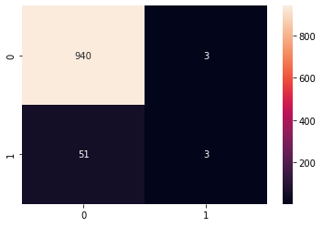
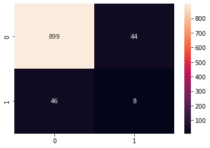

# Laporan Proyek Machine Learning - Christopher Adrian Kusuma

## Domain Proyek

Stroke merupakan penyebab kematian terbanyak kedua. Hal ini mengakibatkan banyaknya usaha untuk mendeteksi stroke sejak dini, salah satunya dengan metode data mining dan machine learning [1].

Referensi:
1. [Identifying Stroke Indicators Using Rough Set](https://ieeexplore.ieee.org/stamp/stamp.jsp?arnumber=9264165)

## Business Understanding

### Problem Statements
Adapun masalah yang diangkat adalah sebagai berikut:
- Bagaimana cara mendeteksi stroke menggunakan teknik machine learning?

### Goals
Adapun tujuan dari proyek ini adalah:
- Menggunakan machine learning untuk mendeteksi stroke

### Solution statements
Adapun solusi yang penulis tawarkan adalah sebagai berikut:
- Membandingkan hasil dari lima algoritma machine learning, yaitu AdaBoost, Gradient Boosting, Random Forest, Decision Tree, dan SVM
- Menggunakan berbagai metrik pengukuran, yaitu akurasi, precision, recall, dan f1-score.

## Data Understanding
Paragraf awal bagian ini menjelaskan informasi mengenai data yang Anda gunakan dalam proyek. Sertakan juga sumber atau tautan untuk mengunduh dataset. Contoh: [UCI Machine Learning Repository](https://archive.ics.uci.edu/ml/datasets/Restaurant+%26+consumer+data).

### Variabel-variabel pada Brain Stroke Prediction dataset adalah sebagai berikut:
- gender: "Male", "Female", "Other"
- age: umur dari pasien
- hypertension: 0 jika pasien tidak memiliki hipertensi, 1 jika pasien memiliki hipertensi
- heart disease: 0 jika pasien tidak memiliki penyakit hati, 1 jika pasien memiliki penyakit hati
- ever married: 0 jika pasien tidak pernah menikah, 1 jika pasien pernah menikah
- work type: "children", "govt job", "never worked", "private", "self-employeed"
- residence type: "rular", "urban"
- avg glucose level: kadar gula rata-rata dalam darah
- bmi: body mass index
- smoking status: "formerly smoked", "never smoked", "smokes", "Unknown"
- stroke: 0 jika pasien tidak memiliki stroke, 1 jika pasien memiliki stroke

### Exploratory Data Analysis
Penulis mengelompokan umur pasien menjadi 0-22, 23-30, 31-60, dan >60. Berikut merupakan distribusi data pasien berdasarkan variabel dataset:

Dari gambar tersebut, dapat dilihat bahwa terdapat ketidakseimbangan dataset, khususnya pada variabel target stroke. Hal ini dapat memengaruhi model machine learning yang akan dibahas lebih lanjut saat evaluasi.

## Data Preparation
- Mengubah data kategorikal menjadi data yang dimengerti mesin, yaitu angka. 
  - Mengubah gender dan ever married menjadi 0 dan 1.
  - Melakukan one hot encoding untuk data kategorikal lainnya, yaitu age, work type, residence type, dan smoking status.
- Melakukan data splitting menjadi data latih dan data test dengan perbandingan 80:20
- Melakukan normalisasi data numerical sehingga memiliki mean 0 dan standard deviation 0

## Modeling
Penulis menggunakan 5 model machine learning yang berbeda, yaitu:
1. AdaBoost
2. Gradient Boosting
3. Random Forest
4. Decision Tree
5. SVM

Semua model dilatih menggunakan parameter default yang disediakan library sklearn.

## Evaluation
Metrik yang digunakan ada 4, yaitu:
1. Accuracy
2. Precision
3. Recall
4. F1 Score

Berikut merupakan rumus dari keempat metrik tersebut:
1. Accuracy = (TP + TN) / (TP + TN + FP + FN)
2. Precision = TP / (TP + FP)
3. Recall = TP / (TP + FN)
4. F1 Score = 2 * (Precision * Recall) / (Precision + Recall)

Pada permasalahan ini, mendeteksi pasien dengan stroke sangatlah penting. Oleh karena itu, metrik paling sesuai untuk masalah ini adalah recall dan berusaha untuk meminimalkan jumlah false negative. Adapun jumlah false positive adalah prioritas kedua untuk diminimalisir.

Berikut merupakan hasil dari pelatihan model pertama kali:
||Accuracy|Precision|Recall|F1 Score|
|---|---|---|---|---|
|AdaBoost         |0.945838|0.0     |0.0     |0.0     |
|Gradient Boosting|0.945838|0.5     |0.055556|0.1     |
|Random Forest    |0.942828|0.0     |0.0     |0.0     |
|Decision Tree    |0.909729|0.153846|0.148148|0.150943|
|SVM              |0.945838|0.0     |0.0     |0.0     |







Dapat dilihat bahwa kelima model memiliki nilai recall yang rendah dengan banyak nilai false negative. Hal ini kemungkinan diakibatkan karena data yang tidak imbang di mana terdapat 4733 data pasien tanpa stroke dibandingkan 248 pasien dengan stroke. Oleh karena itu, penulis mencoba melakukan random undersampling untuk menyeimbangkan data.
```python
stroke_len = df['stroke'].value_counts()[1]
df2 = df[df['stroke'] == 0].sample(stroke_len, random_state=42).copy()
df2 = pd.concat([df2, df[df['stroke'] == 1]])
```
Hasil pelatihan model dengan data yang seimbang adalah sebagai berikut:
||Accuracy|Precision|Recall|F1 Score|
|---|---|---|---|---|
|AdaBoost         |0.65    |0.647059|0.66    |0.653465|
|Gradient Boosting|0.61    |0.603774|0.64    |0.621359|
|Random Forest    |0.6     |0.596154|0.62    |0.607843|
|Decision Tree    |0.55    |0.539683|0.68    |0.60177 |
|SVM              |0.67    |0.688889|0.62    |0.652632|


Dapat dilihat bahwa kelima model memiliki nilai recall yang jauh lebih baik dari model yang sebelumnya. Di mana model terbaik adalah model Decision Tree dengan nilai recall 0.68 dan jumlah false negative terkecil yaitu 16. 

Penulis juga menguji model ini terhadap data test yang pertama kali (997 data) dengan hasil sebagai berikut:

||Accuracy|Precision|Recall|F1 Score|
|---|---|---|---|---|
|AdaBoost         |0.68004 |0.118156|0.759259|0.204489|
|Gradient Boosting|0.681043|0.12069 |0.777778|0.208955|
|Random Forest    |0.688064|0.125364|0.796296|0.216625|
|Decision Tree    |0.624875|0.09596 |0.703704|0.168889|
|SVM              |0.749248|0.15    |0.777778|0.251497|


Terlihat bahwa model bekerja dengan sangat baik di mana model terbaik adalah model Random Forest dengan nilai recall 0.79 dan jumlah false negative terkecil yaitu 11. Akan tetapi terdapat model lain yang perlu dipertimbangkan, yaitu model SVM. Model SVM memiliki penilaian yang lebih general daripada Random Forest dan Decision Tree di mana SVM memiliki nilai precision yang lebih tinggi, memiliki nilai recall yang sedikit lebih kecil, dan jumlah false positive yang jauh lebih rendah dari kedua model.

Berdasarkan percobaan yang telah penulis lakukan, penulis memilih 2 model sebagai model terbaik untuk masalah ini, yaitu Random Forest dan SVM.