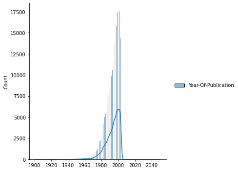
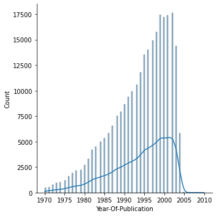
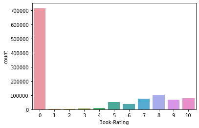

# Laporan Proyek Machine Learning - Christopher Adrian Kusuma

## Project Overview

Membaca buku merupakan aspek yang sangat penting untuk membentuk sifat seseorang, mengembangkan metode berpikir dan menciptakan ide baru. Orang yang sering membaca buku cenderung memiliki wawasan yang luas dan memiliki kemampuan belajar yang tinggi [1].

Melihat pentingnya manfaat membaca buku, kita perlu membaca buku lebih banyak lagi. Kita tentu saja memiliki beberapa preferensi saat membaca buku. Selain itu, ada banyak sekali buku yang diterbitkan dan perlu kita saring sesuai dengan preferensi kita. Oleh karena itu, dibutuhkan sistem rekomendasi yang akan menyaring buku-buku tersebut untuk kita.

## Business Understanding

### Problem Statements

Adapun permasalahan yang diangkat pada proyek ini adalah:
- Bagaimana cara memilih buku yang sesuai dengan preferensi seseorang?

### Goals

Adapun tujuan proyek ini adalah:
- Mengetahui cara memilih buku yang sesuai dengan preferensi seseorang

### Solution statements
- Menggunakan 2 pendekatan berbeda untuk sistem rekomendasi, yaitu Content-based dan Collaborative Filtering

## Data Understanding
Dataset diunduh dari [Book Recommendation Dataset](https://www.kaggle.com/datasets/arashnic/book-recommendation-dataset). Dataset ini terdiri dari 3 file csv:
- Books.csv
- Ratings.csv
- Users.csv

Variabel-variabel pada Books.csv adalah sebagai berikut:
- ISBN: ISBN dari buku
- Book-Title: Judul buku
- Book-Author: Penulis buku
- Year-Of-Publication: Tahun terbit buku
- Publisher: Penerbit buku
- Image-URL-S: URL gambar buku ukuran S
- Image-URL-M: URL gambar buku ukuran M
- Image-URL-L: URL gambar buku ukuran L

Variabel-variabel pada Ratings.csv adalah sebagai berikut:
- User-ID: ID pengguna
- ISBN: ISBN dari buku
- Book-Rating: Rating buku

Variabel-variabel pada Users.csv adalah sebagai berikut:
- User-ID: ID pengguna
- Location: Lokasi pengguna
- Age: Umur pengguna

Analisis data:
### Books

Melihat gambar tersebut, dapat dilihat bahwa tahun terbit buku bervariasi dari tahun 0 hingga 2050. Akan tetapi, buku yang terbit di tahun 0 kemungkinan merupakan kesalahan pada data, begitu pula dengan buku yang terbit di tahun 2050. Karena itu, penulis melakukan filtering buku hanya untuk yang terbit pada tahun 1900 hingga 2010 dengan persebaran ditunjukkan gambar berikut


### Ratings

Melihat gambar tersebut, sangat banyak buku yang memiliki rating 0. Ada 2 kemungkinan untuk hal tersebut, yaitu rating tersebut merupakan nilai default karena pengguna belum memberikan rating untuk buku tertentu atau memang pengguna memberikan rating 0 terhadap buku tersebut.

### Users

Dapat dilihat persebaran umur pengguna yang beragam dari 0 hingga 244. Dari gambar ini dapat dilihat bahwa pembaca buku kebanyakan berasal dari golongan usia anak-anak hingga dewasa.

## Data Preparation

### Books
Penulis menghapus kolom Image-URL-S, Image-URL-M, dan Image-URL-L karena tidak diperlukan.

### Ratings
Penulis menghapus rating 0 dari dataset ratings.

### Users
Penulis hanya mengambil user yang berumur antara 10 hingga 70 tahun.

### Merging
Penulis menggabungkan ketiga dataset untuk digunakan pada tahap modelling.

## Modeling
Pemodelan dilakukan dengan menggunakan 2 metode yang berbeda. Masing-masing metode memberikan n recommendation teratas untuk pengguna.

### Content-based Filtering
Metode ini dilakukan dengan menghitung kemiripan buku berdasarkan penulisnya. Penulis mengimplementasikan algoritma ini menggunakan Tf-Idf dan menghitung kemiripan buku menggunakan cosine similarity. Rekomendasi buku didasarkan pada kemiripan buku dengan buku yang pernah dibaca pengguna tersebut sebelumnya.
```python
vectorizer = TfidfVectorizer()
vectorizer.fit(book_author_df['Book-Author'])
tfidf_matrix = vectorizer.transform(book_author_df['Book-Author'])
cosine_sim = cosine_similarity(tfidf_matrix) 

def book_recommendations(book_name, similarity_data=cosine_sim_df, items=book_author_df[['Book-Title', 'Book-Author']], k=5):
  index = similarity_data.loc[:, book_name].to_numpy().argpartition(range(-1, -k, -1))
  
  closest = similarity_data.columns[index[-1:-(k+2):-1]]
  closest = closest.drop(book_name, errors='ignore')

  return pd.DataFrame(closest).merge(items).head(k)
```

### Collaborative Filtering
Metode ini merupakan metode filtering dengan membandingkan antar pengguna. Penulis mengimplementasikan algoritma ini menggunakan deep learning dengan aktivasi sigmoid. Rekomendasi buku didasarkan pada kemungkinan rating yang akan diberikan pengguna terhadap buku yang belum pernah dibaca.
```
rating = sigmoid((user_vector . book_vector) + user_bias + book_bias)
```

## Evaluation

### Content-based Filtering


Dapat dilihat dari rekomendasi yang diberikan, sistem cenderung merekomendasikan buku dari penulis yang memiliki nama yang mirip (Wendy atau Hobson). Hal ini menandakan sistem rekomendasi sudah dapat memberikan rekomendasi berdasarkan penulis dari buku yang pernah dibaca oleh pengguna.

### Collaborative Filtering
Model dibuat dengan aktivasi sigmoid dengan loss function mse dan mendapat val_loss sebesar 0,0736.


Seperti yang terlihat, sistem memberikan rekomendasi buku yang kemungkinan akan mendapat rating yang tinggi dari pengguna.

## Referensi:
1. [Reading Habits Among Students and its Effect on Academic Performance: A Study of Students of Koforidua Polytechnic](https://www.academia.edu/download/52948426/fulltext.pdf)
